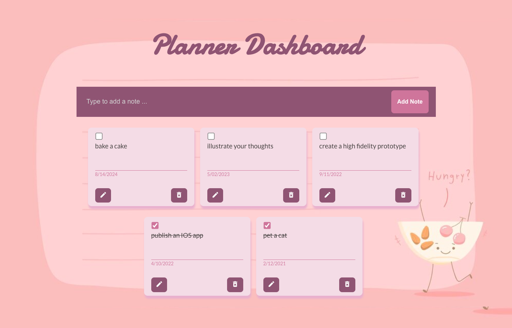

<h1 align="center">Planner Dashboard React App</h1>
<h2>🗣️ About this project</h2>
<ul><li>Used an event handler for creating add note task.</li>
<li>Deleting the completed task from note list using the filter method.</li>
<li>Toggle function and checkbox is added to check completed or not completed task.</li>
<li>Edit an added Note task and submit it using map function.</li>
<li>UseEffect hook will be used to save new todos into localstorage.</li></ul>
 

